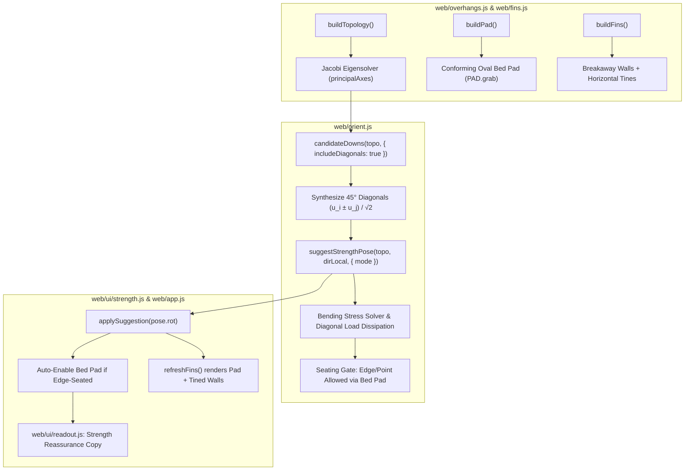

# Strength-Optimized Placement & Active Fin-Pad Coupling Design

- **Date:** 2026-10-07
- **Author:** Antigravity / DeepMind Pair Programming
- **Status:** Approved
- **Target Repository:** `support-fins` (`s:\Github\support-fins`)

---

## 1. Problem Statement & Motivation

Generic slicers (Bambu Studio, PrusaSlicer, OrcaSlicer, Cura) operate on a fundamental assumption: parts should sit flat on an existing planar face. When a part stands upright or flat, layer lines often run directly across critical stress paths (e.g. transverse bending tension on brackets and cantilever lugs), causing catastrophic inter-layer cleavage under modest mechanical loads.

Tipping a part on edge or slanting it at 45° optimizes mechanical strength:
1. **Diagonal Stress Dissipation**: Layer lines do not form a planar cleavage interface normal to bending tension. Continuous extruded filament loops and 45° infill strands distribute bending and shear across multiple interlocking layers.
2. **True Slicer Independence**: Conventional slicers avoid tilted/edge poses because standard supports weld to the part, scar surfaces, and cannot prevent tall parts from toppling.
3. **The Core Thesis of Support Fins**: **"Tip a part on edge, and Support Fins adds the breakaway support fins and bed pad that make that orientation printable — baked right into the STL."**

Previously, the codebase had residual assumptions from flat-face printing:
- `candidateDowns` only tested planar face normal clusters and 6 cardinal axes ($X, Y, Z$). Models without chamfers never had 45° diagonal candidates evaluated.
- `suggestStrengthPose` filtered candidates using raw polygonal `bedArea >= 25 mm²`, inadvertently disqualifying the very edge-tilted, strength-optimized poses the fin engine was built to stabilize.
- The UI treated edge-seated parts with anxious warning text (*"balances on one point with nothing under it..."*) rather than celebrating strength-optimized placement.

---

## 2. Architecture & Subsystems



---

## 3. Detailed Component Specifications

### 3.1 Candidate Down Vector Synthesis (`web/orient.js`)

In `candidateDowns(topo, { includeDiagonals = false })`:
- Base candidates: face normal clusters with significant area, plus 6 cardinal unit vectors (`[±1, 0, 0]`, `[0, ±1, 0]`, `[0, 0, ±1]`).
- When `includeDiagonals = true` (used by `suggestStrengthPose`):
  - Extract principal inertia axes from `topo.principalAxes` (`long`, `mid`, `short`).
  - Synthesize 12 diagonal unit vectors formed by pairwise normalized additions and subtractions:
    $$\vec{d}_{\text{diag}} = \frac{\pm \vec{u}_a \pm \vec{u}_b}{\sqrt{2}} \quad \text{for } (a, b) \in \{(\text{long}, \text{mid}), (\text{long}, \text{short}), (\text{mid}, \text{short})\}$$
  - Deduplicate directions with dot-product threshold $> 0.99$.
  - This ensures that any slender column, clevis, or beam (even a simple unchamfered box) is automatically evaluated in 45° tilted poses where layers cross the bending axis diagonally.

### 3.2 Strength Solver & Seating Viability (`web/orient.js`)

In `suggestStrengthPose(topo, dirLocal, { threshold = 45, mode = 'pull' })`:
1. **Target Evaluation**:
   - In **Pull mode**: evaluates $|d_z| / \|\vec{d}\|$.
   - In **Lever mode**: evaluates the tensile stress along the principal beam axis $\vec{b}_{\text{world}} = R \cdot \vec{u}_{\text{long}}$.
   - When tilted diagonally, $\text{cross} \approx \sin(45^\circ) = \frac{1}{\sqrt{2}} \approx 0.707$, but tension is shared across both continuous filament loops and inter-layer infill.
2. **Seating Gate**:
   - Revert the `minBed >= 25 mm²` filter.
   - Poses resting on a line/edge or vertex are **fully eligible**, because `buildPad` generates a wide, 1 mm-thick elliptical conforming pad with a 0.05 mm tack.
   - True floating parts (airborne without contact) remain dropped.
3. **Deterministic Tie-Breaking**:
   ```javascript
   affordable.sort((p, r) => (p.cross - r.cross) || (p.printCost - r.printCost) || (r.bedArea - p.bedArea));
   ```
   Picks the pose with optimal layer alignment, followed by lower print/support cost, followed by larger contact area.

### 3.3 Active Bed Pad & Fin Auto-Stabilization (`web/ui/strength.js`, `web/app.js`)

When the user clicks **"Turn to the strongest printable pose"**:
1. Apply the suggested rotation matrix to `part`.
2. Inspect the seated analysis of the new pose:
   - If `a.bedArea < 15.0 mm²` (edge-seated or point-seated):
     - Automatically check the Bed Pad toggle:
       ```javascript
       if (el('bed-pad') && !el('bed-pad').checked) {
         el('bed-pad').checked = true;
         setBedPad(true);
       }
       ```
3. Trigger `refreshFins()` to generate the conforming oval bed pad and tined fin walls immediately.

### 3.4 UI Readouts & Positive Framing (`web/ui/readout.js`)

Transform readouts when strength-optimized placement is active:
- When a part rests on an edge or point with the bed pad active:
  - Old: *"this part balances on one point, so the bed pad is holding it. Print with the pad on"*
  - New: *"Tilted on edge for maximum strength. The conforming bed pad and breakaway fins lock the part to the build plate. Slice with supports OFF."*
- In the Strength panel note:
  - If tilted diagonally: *"Diagonal layer orientation distributes bending tension across continuous extruded strands. Good."*

---

## 4. Verification & Testing

1. **Unit Testing (`tests/orient.test.js`)**:
   - Verify `candidateDowns` synthesizes diagonal directions when `includeDiagonals: true`.
   - Verify `suggestStrengthPose` finds and recommends 45° tilted poses for rectangular posts under bending moments.
   - Verify edge-seated poses are retained as viable candidates when bed pad is available.
2. **Support Generation Testing (`tests/supports.test.js`)**:
   - Verify that point-seated and edge-seated tilted models (e.g. `cube/X45`, `wedge/X45`) generate watertight conforming bed pads and gripping tines.
3. **Manual Desktop E2E Verification**:
   - Launch `dist/support-fins.exe`.
   - Load `prototype/stress/models/lbracket.stl`.
   - In Lever mode, click "Turn to the strongest printable pose".
   - Confirm part rotates to the strength-optimized orientation, Bed Pad is automatically checked, and the 3D viewport displays the conforming oval pad and tined fins.
